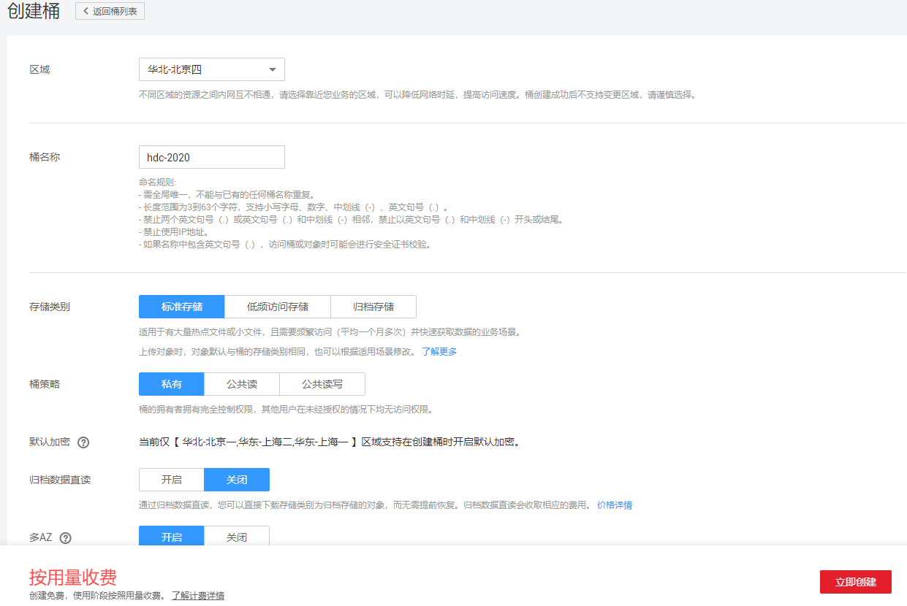

# ModelArts准备工作

## 创建账号

### 创建华为云账号

参考[此链接](https://support.huaweicloud.com/prepare-modelarts/modelarts_08_0001.html)，注册华为云账号。

### 实名认证

参考[此链接](https://support.huaweicloud.com/usermanual-account/zh-cn_topic_0133456714.html)，完成实名认证，推荐使用扫码认证。

## ModelArts全局配置

参考[此文档](https://support.huaweicloud.com/prepare-modelarts/modelarts_08_0002.html)，生成访问密钥，并完成ModelArts全局配置。

**注意**：访问密钥文件请妥善保存，使用OBS客户端会用到。

## OBS操作

### 创建OBS桶

**OBS**，即**Object Storage Service**，对象存储服务，是华为云上提供云上数据储存的服务。在使用ModelArts之前您需要创建一个OBS桶。 

登录[OBS管理控制台](https://storage.huaweicloud.com/obs/#/obs/manager/buckets)， 单击页面右上角"**创建桶**"按钮。

系统弹出如下图所示的对话框，选择"区域"为"华北-北京四"，输入自定义的桶名称，其他选项保持默认即可，最后点击页面下方"立即创建"按钮。 

### 安装并登录OBS Browser+

OBS Browser+是OBS客户端，方便用户上传和下载文件。

点击[此链接](https://support.huaweicloud.com/browsertg-obs/obs_03_1003.html)，根据操作系统版本下载相应版本的OBS Browser+，并点击`.exe`文件进行安装。

参考[此文档](https://support.huaweicloud.com/browsertg-obs/obs_03_1004.html)，使用访问密钥登录OBS Browser+。

如果是Mac操作系统，可以参考[此文档](https://support.huaweicloud.com/clientogw-obs/zh-cn_topic_0045829055.html)下载和安装OBS Browser。OBS Browser和OBS Browser+的使用方式类似。

**注意**：AK和SK从访问秘钥文件中获取。

### 新建OBS文件夹

使用OBS客户端可以在OBS新建文件夹。打开OBS Browser+，点击进入一个OBS桶，然后点击“新建文件夹”按钮，即可新建文件夹。

### 上传数据至OBS

使用OBS客户端可以上传文件或者文件夹至OBS。打开OBS Browser+，点击进入一个OBS桶，然后点击“上传”按钮，上传本地文件夹或者文件至OBS桶。

